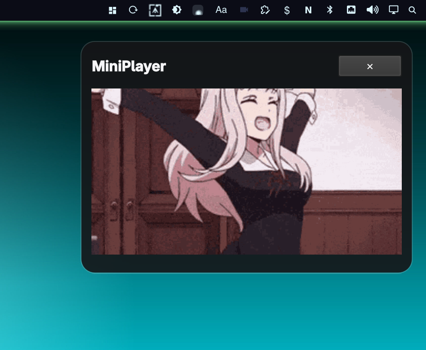

# MiniPlayer


Small Omarchy/Quickshell media panel that stays pinned to the top-right of the screen.

## Features

- Drag and drop support
- Pin local images, GIFs, and videos
- Animated GIF playback
- MP4/MKV/WebM looping playback
- Video audio is muted until the pointer hovers the video
- Persistent pinned-media list in `~/.config/omarchy/miniplayer.json`
- Minimal translucent UI
- Fullscreen Toggle

## Install

```sh
omarchy plugin add https://github.com/maiosx/miniplayer.git
```

Suggested keybind in `~/.config/hypr/bindings.lua`:

```lua
o.bind("SUPER + X", "miniplayer", "omarchy-shell shell toggle miniplayer")
```

Or toggle it with the Omarchy plugin shell integration:

```sh
omarchy-shell shell toggle miniplayer
```
## Remove

```sh
omarchy plugin remove miniplayer
```
## Notes

Video playback uses Qt Multimedia, so the available codecs depend on the Qt multimedia backend installed by the system.

## Known issues
-Gif/images have no close buttons currently

-Super + W does not stop playback on the fullscreen player

-No quickshell icon

MIT License.
